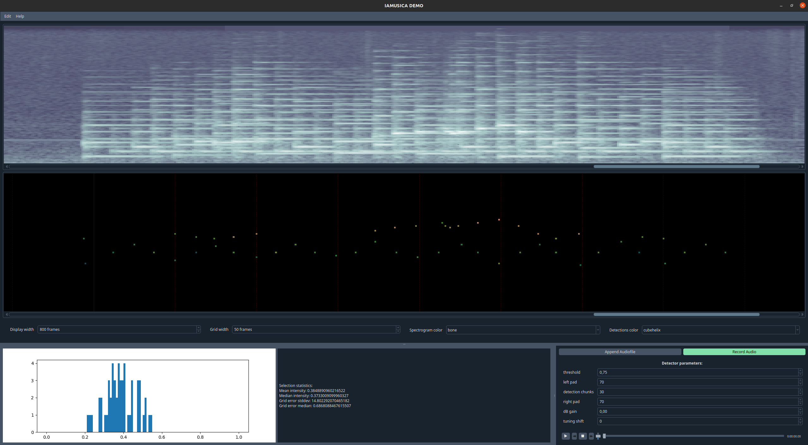
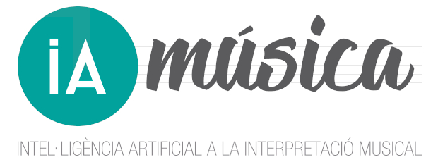
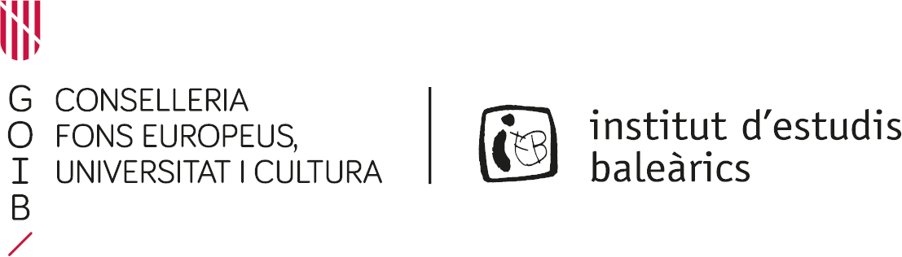
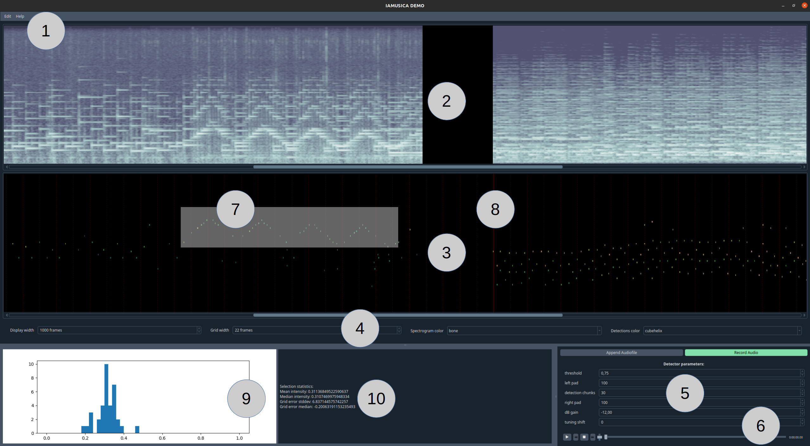

# iamusica_demo



The present repository hosts a highly configurable and extendable desktop graphical application to perform real-time detection of piano note onsets and velocities, developed in the context of the [IAMúsica](https://joantrave.net/en/iamusica/) project. Specifically, it informs about:
* Installation of required software dependencies
* Configuring and running the demo
* Main components
* Usage examples

For the detections, a pre-trained deep learning model is used (provided [here](iamusica_demo/assets/OnsetsAndVelocities_2023_03_04_09_53_53.289step=43500_f1=0.9675__0.9480.torch)). See [the companion repository](https://github.com/andres-fr/iamusica_training) as well as our [paper](https://arxiv.org/abs/2303.04485) for details about training and evaluating the model, and consider citing our work if this demo is useful to you:

```
@inproceedings{onsvel,
      title={{Onsets and Velocities}: Affordable Real-Time Piano Transcription Using Convolutional Neural Networks},
      author={Andres Fernandez},
      year={2023},
      booktitle={{EUSIPCO} Proceedings},
}
```


> :warning:
> Note that the detector has been trained on modern piano recordings, and its performance may suffer for different instruments and in contaminated/noisy environments.
> To facilitate detection quality, the demo includes a series of tunable parameters (more details below).


 

*IAMúsica was supported by research grant [389062, INV-23/2021](http://www.iebalearics.org/media/files/2022/02/10/resolucio-definitiva-inv-boib-2021-cat.pdf) from the [Institut d'Estudis Baleàrics](http://www.iebalearics.org/ca/), and is composed by:*
* [Eulàlia Febrer Coll](https://www.researchgate.net/profile/Eulalia-Febrer-Coll)
* [Joan Lluís Travé Pla](https://joantrave.net/en)
* [Andrés Fernández Rodríguez](https://aferro.dynu.net)

This is [Free/Libre and Open Source Software](https://www.gnu.org/philosophy/floss-and-foss.en.html), see the [LICENSE](LICENSE) for more details!
Particularly, we welcome improvement suggestions, bug reports, and any other kind of feedback+contributions through the [issues](https://github.com/andres-fr/iamusica_demo/issues).


---

# Software dependencies

We use `PyTorch` for the backend and `PySide2` (a Python wrapper for `Qt 5.12+`) for the frontend. The following instructions should allow to create a working environment from scratch, with all required dependencies (tested on `Ubuntu 20.04` with `conda 4.13.0`):

```
# create and activate conda venv
conda create -n iamusica_demo python==3.9
conda activate iamusica_demo

# conda dependencies
conda install pytorch==1.11.0 torchvision==0.12.0 torchaudio==0.11.0 -c pytorch
conda install pyside2==5.13.2 -c conda-forge
conda install pyaudio==0.2.11 -c anaconda
conda install gstreamer==1.18.5 gst-plugins-base==1.18.5 gst-plugins-good==1.18.5 gst-plugins-good-pulseaudio==1.18.4 -c conda-forge -c dtk-forge
conda install omegaconf==2.1.2 -c conda-forge
conda install pandas==1.4.2 -c anaconda
conda install h5py==3.6.0 -c anaconda
conda install matplotlib==3.4.3 -c conda-forge
conda install scipy==1.8.0 -c conda-forge

# pip dependencies
pip install qdarkstyle==3.1
pip install pytz==2021.3
pip install coloredlogs==15.0.1
```

See the full [requirements](assets/requirements.txt) for a comprehensive list.


---

# Running the demo


The demo stores and loads session in the form of HDF5 files inside of a *workspace*. To start the demo, simply issue the following command:

```
python -m iamusica_demo
```

The following detection settings provide good detection both loading fairly modern recordings as well as when run from a laptop, using the built-in 16kHz microphone, and at about 2m distance from the piano:

| **name**     | **value**        | **description**                                                    |
|:------------:|:----------------:|:------------------------------------------------------------------:|
| `OVIF`       | `(100, 30, 100)` | onset+value inference frame sizes (left pad, detection, right pad) |
| `PTHRESH`    | `0.75`           | probability threshold for onset detection                          |
| `MEL_OFFSET` | `-12`            | audio intensity offset, in decibels                                |


They can be run from the start as follows:

```
python -m iamusica_demo OVIF="[100, 30, 100]" PTHRESH=0.75 MEL_OFFSET=-12
```

The currently available configurations can be inspected as follows:

```
python -c "from iamusica_demo.__main__ import ConfDef; print(ConfDef.__doc__)"
```


---

# Main components



| **number** | **name**                | **description**                                                                 |
|:----------:|:-----------------------:|:-------------------------------------------------------------------------------:|
| 1          | Toolbar                 | Menus to manage sessions and get help                                           |
| 2          | Logmel-Spectrogram area | Displays the processed audio (x=time, y=frequency)                              |
| 3          | Piano roll area         | Displays the detections (aligned with spectrogram)                              |
| 4          | View settings           | Change the spectrogram and pianoroll appearance                                 |
| 5          | Detection parameters    | Adjust how the detection input/output is processed                              |
| 6          | Audio player            | Plays the audio shown in the spectrogram                                        |
| 7          | Mouse selection         | Click-and-drag on piano roll to select notes                                    |
| 8          | Vertical grid           | Left double-click on piano roll to set piano grid, right double-click to remove |
| 9          | Velocity histogram      | Velocity histogram for current note selection                                   |
| 10         | Selection statistics    | Statistics for current note selection                                           |


* See `Help->Keyboard shortcuts` for convenience hotkeys to control e.g. the audio player and view settings.
* **Threshold**: Set this to a higher number if the detection contains false positives, and lower if false positives.
* **Left pad, detection chunks, right pad**: The detector is a "sliding window", whose total size in time frames is the sum of these 3. The actual detections are performed in consecutive blocks of size `detection_chunks`, but context at both left and right sides is important to avoid boundary artifacts. This is given by the left and right `pads`. Smaller window sizes lead to lower latency, but potentially worse detection. A configuration of `(100, 30, 100)` delivers good results with reasonably low latency (about 5.5 seconds, at `~42` frames per second).
* **dB gain**: This can be calibrated to ensure that the velocity detection is within the desired range. The detector seems to be decently robust against this.
* **Tuning shift**: "Vertical shift" of the spectrogram, in number of frequency bins. I.e. a positive number will shift the spectrogram upwards, causing the detector . This parameter is experimental.
* **Statistics**: If piano grid is active when notes are selected, the statistics will also show grid alignment.


---
# Usage examples


### 1. Creating a new session and loading+exploring a file

1. Start the app, e.g. via `python -m iamusica_demo OVIF="[100, 30, 100]" PTHRESH=0.75 MEL_OFFSET=-12`.
2. In the menu bar, select `Edit->Create session` to open a file browser, and provide a *workspace* location where the newly created session will be stored.
3. At the bottom right, click on `Append Audiofile` and browse select a file with a piano recording. Upon confirmation, the detector should run on the file with the currently active parameters, and the spectrogram and piano roll will be populated with the file contents.
4. To explore the file, the spectrogram and piano roll windows can be moved horizontally and stretched vertically. Horizontal zoom is possible through the `Display width` parameter. The audio player will also now be able to play the loaded file.
5. Once done, close the window (session changes are automatically saved)

### 2. Opening a previous session and extending it with recordings

1. Start the app as before, and open the previously created session via `Edit->Open session` (select the specific session folder inside the *workspace*). The previously loaded and processed file should reappear on the display.
2. At the bottom right, click on `Record Audio`. After a while, the spectrogram and piano roll should be updated with audio being recorded in real time. Detection parameters can also be changed during recording, which is useful to tune the detector for a specific setting. Whenever done, click on `Stop Recording`.


### 3. Analizing recorded fragments

The piano roll displays the detected note intensities by color, but we can get a more precise reading by selecting notes via click-and-drag. The velocities will show up as a histogram in the bottom left corner. Furthermore, velocity statistics for the selection will also be shown to the right of the histogram.

The user can also create a vertical grid via left mouse double-click. This will create a thick vertical line at the clicked location, and a grid to both sides with the width specified by `Grid width` at the view settings panel. Width can be changed at any point, and the grid can be removed via right mouse double-click.

If notes are selected when the grid is present, some alignment-related statistics will also be shown at the right of the histogram.

The velocity analysis tool can be used to e.g. compare the velocity profies of different performances for the same fragment.
The grid analysis can be used to e.g. quantify rubatos or assess time precision.
