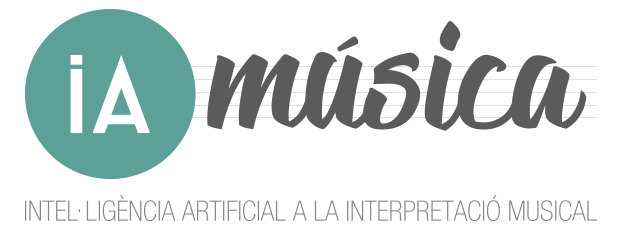
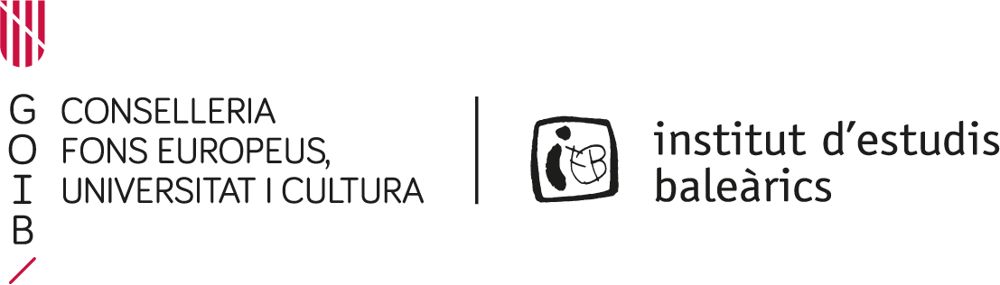

# iamusica_demo

The present repository hosts a highly configurable and extendable desktop graphical application to perform real-time detection of piano note onsets and velocities, developed in the context of the [IAMúsica](https://joantrave.net/en/iamusica/) project. Specifically, it provides the means to:
* Install the required software dependencies
* Configure and run the demo

See [this companion repository](https://github.com/andres-fr/iamusica_training) for details about the Deep Learning model used for the detections.

 

*IAMúsica was supported by the [Institut d'Estudis Baleàrics](http://www.iebalearics.org/ca/), and is composed by:*
* [Eulàlia Febrer Coll](https://www.researchgate.net/profile/Eulalia-Febrer-Coll)
* [Joan Lluís Travé Pla](https://joantrave.net/en)
* [Andrés Fernández Rodríguez](https://aferro.dynu.net)

This is [Free/Libre and Open Source Software](https://www.gnu.org/philosophy/floss-and-foss.en.html), we welcome any contributions to improve it!

# Software dependencies

# Running the demo

These are the currently exposed options:
